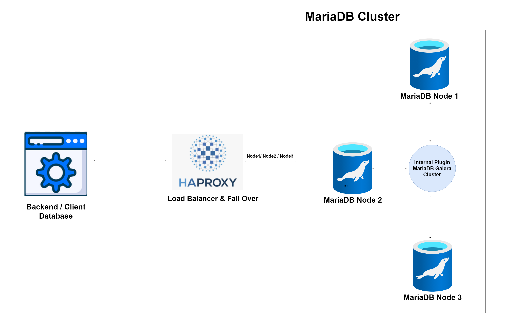
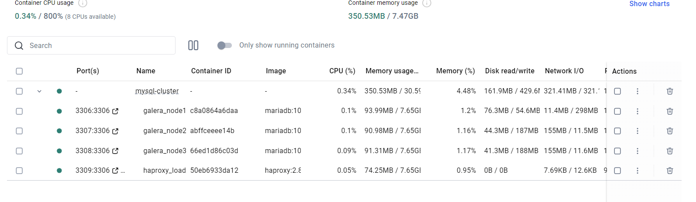
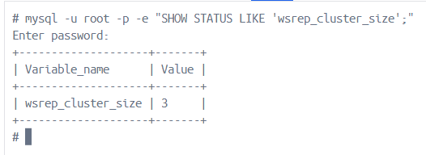
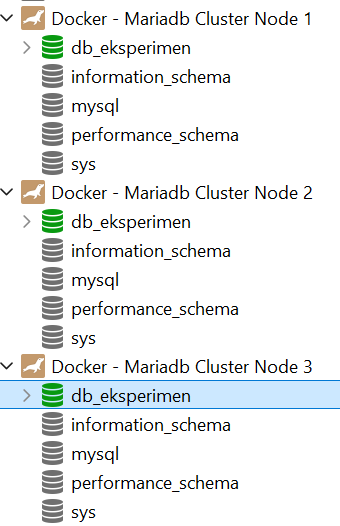
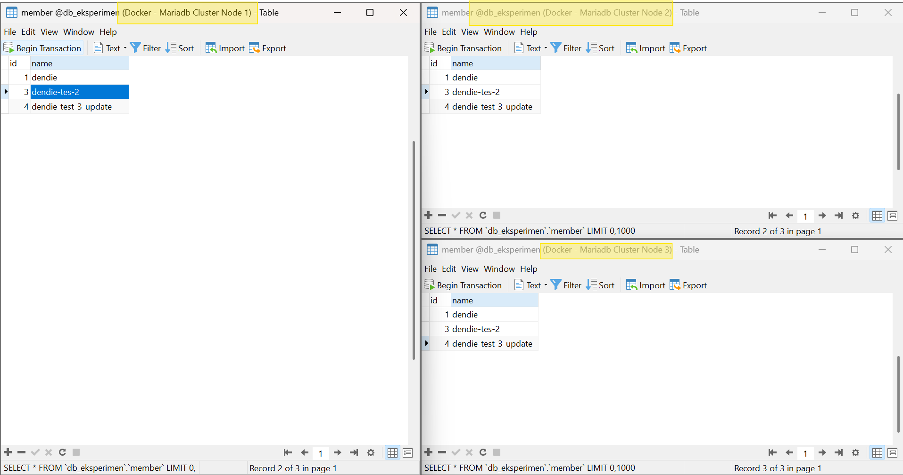
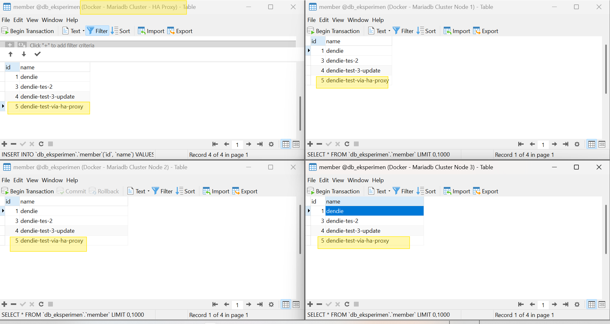
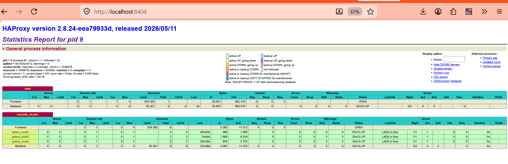

# Database Cluster with HAProxy (Load Balancer & Failover)
This project explains how a Database Cluster works using **MariaDB Galera Cluster** (as the clustered database) and **HAProxy** (as the Load Balancer and Failover manager).


## 1. Business Benefits of Database Clustering, High Availability, and Disaster Recovery
From a business perspective, keeping databases online and secure is critical. Here is why database clustering (like MariaDB Cluster or Elasticsearch Cluster) and HAProxy are important for business:
### 1.1 High Availability (HA) - No Downtime
* **Business Value:** In modern e-commerce, banking, or SaaS platforms, every second of downtime costs money. 
* **Explanation:** High Availability ensures that if one database server goes down, another server immediately takes over. Customers can still access their accounts, make purchases, and view data without experiencing any system errors.
### 1.2 Disaster Recovery (DR) - Data Protection
* **Business Value:** Prevents permanent data loss during hardware failures, fires, or cyberattacks.
* **Explanation:** Disaster Recovery replicates data to multiple servers (or locations). If one server suffers a total hardware failure, the data is safe on other nodes. The business can recover quickly without losing customer records or transaction history.
### 1.3 HAProxy (Load Balancer & Failover) - Fast & Reliable Performance
* **Business Value:** Handles high traffic and keeps the app fast.
* **Explanation:** HAProxy acts as a single gateway. It distributes client requests across all healthy database nodes. If one server is slow or crashes, HAProxy stops sending traffic to it automatically (failover) and redirects users to active servers.

## 1.4 Core Technical Concepts Explained
To better understand the infrastructure, here are the key technical concepts:
### A. DRC (Disaster Recovery Center) Data Replication
* **Concept:** A DRC is a secondary facility where data and infrastructure are duplicated to keep the business running if the main Data Center (DC) fails.
* **How it works:** Data from the primary DC is continuously replicated to the DRC. Replication can be:
  * **Synchronous:** Data is written to both DC and DRC at the same exact time (highly secure, zero data loss, but slightly slower).
  * **Asynchronous:** Data is written to the primary DC first, then copied to the DRC with a small delay (faster, but minimal risk of losing a few seconds of data during a sudden crash).
### B. Failover (Automatic Switching)
* **Concept:** Failover is the backup mechanism that automatically switches operations to a standby node or server when the primary node fails.
* **How it works:** 
  * If the primary database crashes, the monitoring system (like HAProxy or cluster coordinators) detects the failure.
  * It immediately redirects all incoming traffic to a backup (Replica) node.
  * The Replica is promoted to become the new Primary node. This switch happens automatically in seconds without manual intervention.
### C. Load Balancing (Traffic Distribution)
* **Concept:** The process of distributing incoming network traffic or queries across multiple servers.
* **How it works:** Instead of sending all client requests to a single server (which would overload it), a Load Balancer (like HAProxy) routes the traffic evenly to all active backend servers. This keeps response times fast, prevents server crashes, and utilizes system hardware resources efficiently.

## 2. Cluster Architecture Design
Here is the design and architecture of our database cluster:

### Explanation of Architecture:
1. **User Layer (Client & Apps):** The applications, database clients, or dashboards make requests to access or write database records.
2. **Load Balancer Layer (HAProxy):** Receives all incoming database traffic (port `3309`) and routes it to the backend database instances using the Round Robin strategy.
3. **Core Layer (MariaDB Node 1, Node 2 & Node 3):** The database cluster operating with Galera replication. All nodes share data, replicate information, and maintain consistency.
4. **Data Layer (Storage 1, Storage 2 & Storage 3):** Each node has its own storage volume. Data is written synchronously across all active nodes to prevent data loss.

## 3. Step-by-Step Setup & Evidence Screenshots
Below is the step-by-step implementation guide with corresponding screenshots from the `ss/` directory showing the process flow.

### Step 1: Deploying MySQL/MariaDB Galera Cluster using Docker Compose
Deploy the cluster nodes and HAProxy load balancer using the command: `docker-compose up -d`.


### Step 2: Checking Cluster Status and Node Count
Verify the cluster status and verify that the node count matches the expected number of nodes (e.g., `wsrep_cluster_size` should be 3).


### Step 3: Testing Direct Connection to Each Node
Verify database connectivity directly to the three database cluster nodes on their respective ports.


### Step 4: Testing CRUD Replication Across Cluster
Perform insert, update, and delete operations on one node and confirm that the modifications are instantly synchronized across all other nodes.


### Step 5: Testing Database Connection via HAProxy Load Balancer
Ensure that client connections through the HAProxy entry point (port `3309`) are working and properly balanced across backend nodes.


### Step 6: HAProxy Statistics Dashboard
Monitor the active status and statistics of all backend MariaDB nodes using the HAProxy stats dashboard (on port `8404`).


## 4. Key HAProxy Configuration (Load Balancing & Failover)
Here is the most critical backend configuration in our `haproxy.cfg`:
```haproxy
# Konfigurasi Load Balancer untuk MariaDB Galera
listen mariadb_cluster
    bind *:3306
    mode tcp
    # Menggunakan metode roundrobin (bergantian: node1 -> node2 -> node3 -> kembali ke node1)
    balance roundrobin
    
    # Deteksi kesehatan database (Health Check) secara berkala
    option tcp-check
    
    server galera_node1 node1:3306 check inter 2s rise 2 fall 3
    server galera_node2 node2:3306 check inter 2s rise 2 fall 3
    server galera_node3 node3:3306 check inter 2s rise 2 fall 3
```

### Configuration Details:
1. **`balance roundrobin` (Load Balancing Scheme)**
   * **What it does:** Distributes incoming database queries sequentially to each of the Galera nodes.
   * **Benefit:** Balance the load evenly across all nodes.
2. **`option tcp-check` (Health Check Endpoint)**
   * **What it does:** Uses TCP port status checks to verify database responsiveness.
   * **Benefit:** Automatically detects if a database instance is responsive.
3. **`check inter 2s rise 2 fall 3` (Failover & Recovery Parameters)**
   * **`check`**: Enables automatic node status checking.
   * **`inter 2s`**: Interval of 2 seconds between checks.
   * **`fall 3`**: Marks node DOWN after 3 consecutive failures.
   * **`rise 2`**: Restores node to active pool after 2 consecutive successful checks.
